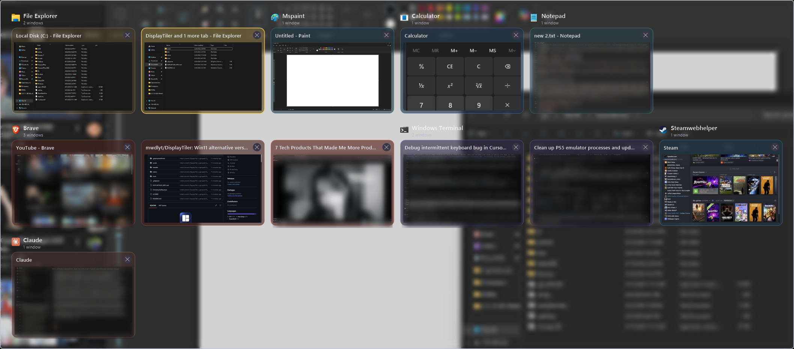

<div align="center">


# DisplayTiler

**A grouped `Alt`+`Tab` replacement for Windows 11.**

Windows are organised by application instead of thrown into one flat strip, each card shows a live
DWM preview, and every card is tinted with its own application's colour so you can find the one you
want by shape and hue before you have finished reading any titles.



</div>

---

## What it does

- **Groups windows by application.** Fifteen browser tabs and three terminals stop being fifteen
  identical entries you have to read one at a time.
- **Live previews.** Cards are real DWM thumbnails, not stale screenshots.
- **Per-application colour.** The accent for each card is sampled from that application's own icon,
  so File Explorer reads gold and Claude reads orange.
- **Close windows from the switcher.** `Delete`, `Ctrl`+`W`, or the card's × button.
- **Two layouts.** *Packed grid* seats small groups side by side on a shelf; *category rows* gives
  every application a full-width section.
- **Stays out of the way.** No main window, no console. It lives in the notification area and idles
  at a few megabytes.

## Install

Download the latest [release](https://github.com/mwdlyt/DisplayTiler/releases):

| | |
|---|---|
| **`DisplayTiler-x.y.z-setup.exe`** | Per-user installer. No administrator rights, no UAC prompt. Offers to start DisplayTiler at sign-in. |
| **`DisplayTiler-x.y.z-portable-win-x64.zip`** | The single executable. Unzip and run it. |

Both are self-contained: **no .NET installation is required.** Windows 11 (build 22000) or newer,
64-bit.

> **Windows will warn you.** The download is not code-signed, so SmartScreen shows *"Windows
> protected your PC"*. Choose **More info → Run anyway**. This is what an unsigned build looks like,
> not a verdict on the file; a signing certificate is an annual cost this project does not carry.

## Using it

Hold `Alt`, press `Tab` until the window you want is selected, release `Alt`. Same muscle memory as
the Windows switcher.

While the switcher is open:

| Key | Action |
|---|---|
| `Tab` / `Shift`+`Tab` | Next / previous window |
| Arrow keys | Move the selection |
| `Enter` | Activate the selected window |
| `Escape` | Dismiss without switching |
| `Delete` or `Ctrl`+`W` | Close the selected window |
| `Ctrl`+`Shift`+`F12` | **Emergency release**. Hands `Alt`+`Tab` straight back to Windows |

Those are the only keys DisplayTiler consumes, and only while the switcher is actually on screen.
No plain letter key is ever intercepted.

Right-click the tray icon for settings, to pause the replacement, to open the switcher without a
keyboard chord, or to exit. Settings live in `%LOCALAPPDATA%\DisplayTiler\settings.json`.

### Sticky mode

**Alt+Tab behaviour → Keep the switcher open until I choose or cancel** leaves the switcher up
instead of activating on `Alt` release. It then waits for a click, `Enter`, or `Escape`.

## How it works

The interesting part of this program is what it does *not* do, because a low-level keyboard hook is
one of the few things a userland application can install that will freeze an entire machine if it
gets it wrong.

**The hook runs on a thread of its own.** Windows dispatches a `WH_KEYBOARD_LL` callback on the
thread that installed it and holds every keyboard *and mouse* event for the whole desktop until that
callback returns. Installing it on the UI thread means any slow paint, screen capture or
cross-process window activation stalls input system-wide. `KeyboardHook` therefore owns a dedicated
thread whose entire job is a message loop and a fast classification function.

**A modifier key-up is never swallowed.** If the release of `Alt` does not reach the rest of the
system, every application goes on believing `Alt` is held: letters stop typing because they become
menu accelerators, and mouse clicks turn into `Alt`+clicks, which is why a double-click on a folder
would open Properties instead of the folder. Dismissing the switcher is DisplayTiler's business; the
release of `Alt` belongs to everyone. Key-downs that *are* consumed have their matching key-up
consumed with them, on a short expiry, so no application is left holding half a keystroke.

**Consumption is gated on something observable.** The hook swallows keys only while the overlay
reports itself genuinely visible, plus a short grace window while it is opening. A boolean set when a
switch was *requested* can outlive a UI thread that never got around to honouring the request; a
window that is really on screen cannot. Past the grace window the hook fails open regardless of what
any flag says.

**Activation never blocks on a hung application.** `AttachThreadInput` merges the caller's input
queue with the target's, so raising a window owned by an application that has stopped pumping
messages will hang the caller for as long as that application stays stuck. Targets are probed with
`SendMessageTimeout(WM_NULL, SMTO_ABORTIFHUNG)` first and the attach is skipped for anything that is
not answering; `SetWindowPos` uses `SWP_ASYNCWINDOWPOS` for the same reason.

**Injected input passes straight through.** Synthetic keystrokes belong to accessibility tools,
remote desktop, and anything trying to clear a stuck modifier. Swallowing those is how such a
tool ends up silently doing nothing.

## Building from source

Requires the [.NET 10 SDK](https://dotnet.microsoft.com/download) on Windows.

```powershell
git clone https://github.com/mwdlyt/DisplayTiler.git
cd DisplayTiler

dotnet build native\DisplayTiler.Host\DisplayTiler.Host.csproj -c Release
dotnet publish native\DisplayTiler.Host\DisplayTiler.Host.csproj -c Release -o dist\win-x64
```

The published `dist\win-x64\DisplayTiler.exe` is a single self-contained file.

> The executable locks itself while running. Stop DisplayTiler before re-publishing, or the publish
> fails with an access-denied error on `DisplayTiler.exe` and you carry on testing the old binary.

To build the installer as well (requires [Inno Setup 6](https://jrsoftware.org/isdl.php)):

```powershell
& "${env:ProgramFiles(x86)}\Inno Setup 6\ISCC.exe" installer\DisplayTiler.iss
```

Tagging `v1.2.3` builds both and publishes a GitHub release; see
[`.github/workflows/release.yml`](.github/workflows/release.yml).

### Layout

| Path | |
|---|---|
| `native/DisplayTiler.Core` | Window records and application grouping. No Windows dependencies. |
| `native/DisplayTiler.Host` | The tray application, the keyboard hook, and the switcher overlay. |
| `installer/` | Inno Setup script. |
| `tools/Build-Icon.ps1` | Regenerates the multi-resolution `.ico` from `assets/DisplayTiler.png`. |

### Tuning the switcher

`SwitcherOverlay` has a single `UiScale` constant. `1.0` is the original size; the shipped value is
`0.75`. Text scales at about a quarter of that rate, derived from the same constant, because type
does not survive being scaled one-for-one with the chrome.

## Known limitations

- **No frosted backdrop on some secondary monitors.** The panel's blur comes from a GDI screen
  capture, and `CopyFromScreen` returns solid black on a monitor whose desktop is composed by a
  different display adapter. Those panels fall back to a flat dark background.
- Most-recently-used ordering is a snapshot taken when the switcher opens, not a running activity
  history.
- Windows that prohibit DWM thumbnail capture show the application icon instead of a preview.

## Licence

[MIT](LICENSE).
